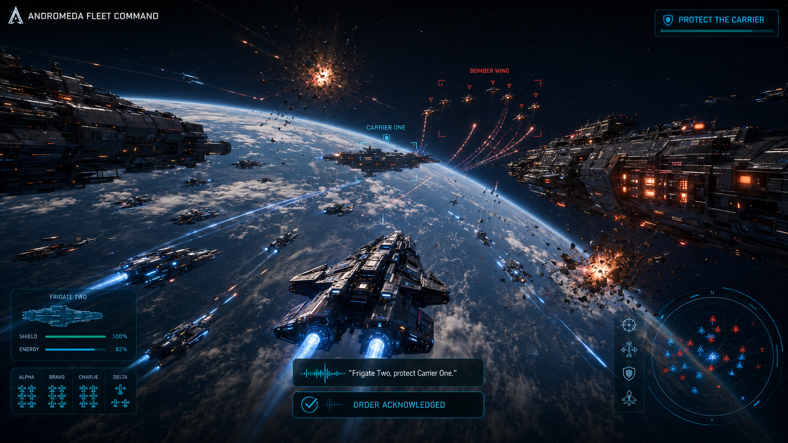

# Andromeda Fleet Command

> **Command every ship with your voice.**

Andromeda Fleet Command is an open-source desktop fleet-combat game intended
for Steam. Fly any vessel directly, switch ships instantly, or give
natural-language orders to deterministic AI pilots.

The runtime is local-first. The trusted offline command parser, simulation, and
ship pilots need no hosted service. Optional integrations can use a local
Ollama model and whisper.cpp.

## Current playable campaign demo

- Three sequential missions with distinct objectives and escalating fleet complexity
- Six coherent scalable vector ship classes with faction tinting, shields, and engine trails
- A four-beat, controller-aware Captain's Drill that teaches the game by doing
- Mission briefings, unlocks, and persistent campaign progress
- Four switchable allied ships with different handling and tactical abilities
- Manual thrust, steering, and weapons
- Natural-language typed fleet commands
- Optional local Ollama interpretation with safe offline fallback
- Optional local whisper.cpp push-to-talk
- In-game local-AI readiness panel and model setup (L)
- Persistent volume, color-vision, reduced-flash, caption, and controller settings
- Gamepad flight, weapons, abilities, ship switching, pause, and menu controls
- Automatic local crash reports under the Godot user-data directory
- Deterministic input replays with final-state checksum verification
- Built-in three-mission simulation benchmark and structured GitHub feedback forms
- Optional GodotSteam achievement adapter and deterministic authoritative-session core
- Tagged CI workflow for checksummed Windows and Linux demo packages
- Layered procedural stereo soundscape with varied weapon, impact, destruction, ability, alert,
  victory, and defeat cues (no licensed sample dependencies)
- Continuous low-frequency engine-room ambience
- Deterministic fixed-step simulation suitable for replays and multiplayer
- Automated parser, combat, mission, persistence, determinism, command, and endurance tests

## Technology

- **Godot 4.7 .NET** — open-source desktop engine and Steam export pipeline
- **C# / .NET 8** — gameplay, simulation, UI, tests, and tooling
- **C++ only where justified later** — llama.cpp, whisper.cpp, or measured
  GDExtension performance hotspots

See [ARCHITECTURE.md](ARCHITECTURE.md) for the rationale.

## Play

### Verified desktop build

The latest clean `main` package is available from the
[successful desktop-demo workflow](https://github.com/karacsonybarni/andromeda-fleet-command/actions/runs/29088052845).
Its artifact contains separate Windows and Linux archives plus portable SHA-256
checksums. The Linux archive is launch-tested headlessly before upload; the
Windows archive is cross-exported and still needs a clean Windows playtest.

### Run from source

Install:

1. [.NET 8 SDK](https://dotnet.microsoft.com/download/dotnet/8.0)
2. [Godot 4.7 .NET](https://godotengine.org/download/)

Then open project.godot in the **.NET build** of Godot and press F6/F5,
or run:

~~~bash
./scripts/run.sh
~~~

On Windows:

~~~powershell
powershell -ExecutionPolicy Bypass -File scripts/run.ps1
~~~

### Controls

- 1–4 or Tab: switch controlled ship
- W / S: thrust / reverse
- A / D: rotate
- Space: fire
- Q: activate the selected ship’s unique tactical ability
- Enter: type a natural-language order
- V: record a local voice command when whisper.cpp is configured
- P: pause
- H: help
- R: restart
- M: mission selection
- N: next mission after victory
- L: local AI and voice setup
- F10: settings and accessibility
- F7: run the simulation benchmark
- F8: open player feedback
- F9: verify the latest saved replay
- Esc: cancel or quit

Try:

~~~text
Frigate Two, intercept the bomber wing
Carrier One, defend the flagship
All ships, attack the enemy flagship
Destroyer Three, retreat
Flagship, move north
~~~

## Optional local AI

The offline parser always works. Press L in-game to scan local services, pull
the recommended Ollama model, choose GPU-preferred or CPU-only inference, and
download the whisper.cpp speech model. GPU acceleration is preferred by default:
the game asks Ollama to offload the full model when supported, with automatic
CPU fallback when GPU support or VRAM is insufficient.

Environment variables remain available for scripted setups:

~~~bash
AFC_OLLAMA=true AFC_OLLAMA_GPU=true AFC_OLLAMA_MODEL=qwen3:4b ./scripts/run.sh
~~~

To enable voice commands, install whisper-cli, download a whisper.cpp model,
and set:

~~~bash
AFC_WHISPER_CLI=/path/to/whisper-cli \
AFC_WHISPER_MODEL=/path/to/ggml-base.en.bin \
./scripts/run.sh
~~~

No cloud model is part of the runtime architecture.

## Test

~~~bash
./scripts/test.sh
./scripts/check.sh
~~~

Headless performance harness:

~~~bash
godot --headless --path . -- --benchmark
~~~

## Export for Steam

Install Godot export templates, then:

~~~bash
./scripts/export.sh windows
./scripts/export.sh linux
~~~

Steamworks sits behind a platform-services adapter; an App ID is not required
for local development. See [docs/STEAM.md](docs/STEAM.md) for the implemented
adapter, packaging workflow, and owner-only release inputs.

## Contribute

PRs are welcome. Start with [CONTRIBUTING.md](CONTRIBUTING.md) and the
[roadmap](docs/ROADMAP.md). The project is MIT-licensed.

> Images under art/concept are AI-generated design concepts, not captured
> in-engine footage. Keep that disclosure wherever these images are published.
