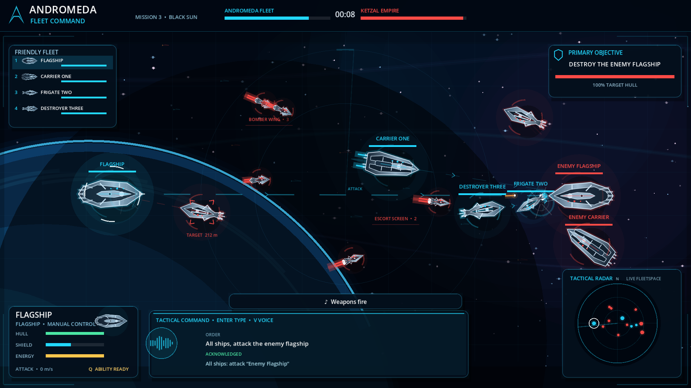
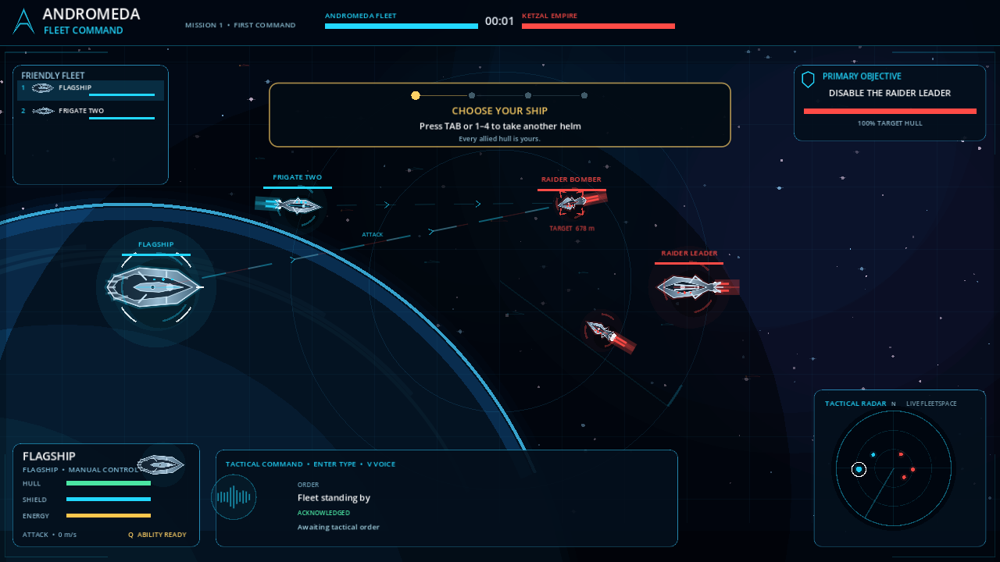
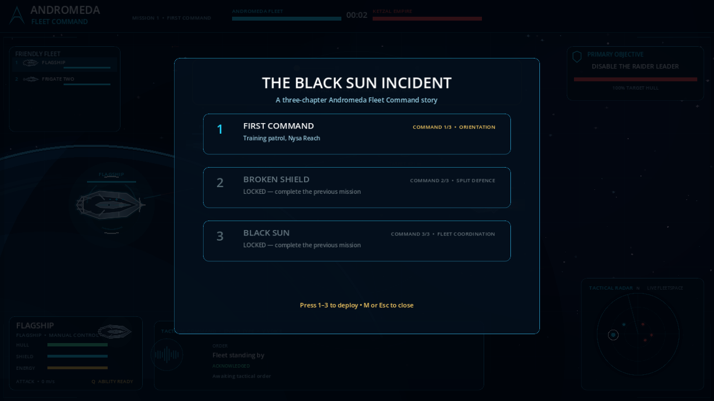

# Andromeda Fleet Command

> **Command every ship with your voice.**

Andromeda Fleet Command is an open-source desktop fleet-combat game intended
for Steam. Fly any vessel directly, switch ships instantly, or give
natural-language orders to deterministic AI pilots.

*Mission 3: Black Sun — four allied ships coordinating an attack on the enemy
flagship. Raw in-engine capture from the current Godot build.*

The runtime is local-first. The trusted offline command parser, simulation, and
ship pilots need no hosted service. Optional integrations can use a local
Ollama model and whisper.cpp.

## Gameplay screenshots

Every image below is an unedited in-engine capture from the current playable
build.

| Captain's Drill | Campaign progression |
| --- | --- |
|  |  |
| Learn ship switching, direct control, fleet commands, and abilities while the battle is running. | The 24-mission story unlocks in order across eight acts, from first patrol to coalition-scale fleet command. |

## Current playable campaign

- A connected eight-act, 24-mission campaign, **Crown of Andromeda**, with a 450-minute
  (7.5-hour) design target, in-engine briefings, and debriefs
- Mission complexity that grows from a two-ship orientation through split defence, interceptions,
  coalition battles, fighting withdrawals, and full-fleet assaults
- Six coherent scalable vector ship classes with faction tinting, shields, and engine trails
- Readable fleet-combat presentation with animated star depth, tactical radar sweep, target brackets,
  projectile bloom, layered shield/thruster effects, impact sparks, explosions, and restrained camera kick
- A four-beat, controller-aware Captain's Drill that teaches the game by doing
- Mission briefings, unlocks, and persistent campaign progress
- Four switchable allied ships with different handling and tactical abilities
- Manual thrust, steering, and weapons
- Natural-language typed fleet commands
- Optional local Ollama interpretation with safe offline fallback
- Optional local whisper.cpp push-to-talk with bundled Windows/Linux runtime
- In-game local-AI readiness panel and model setup (L)
- Persistent volume, color-vision, reduced-flash, caption, and controller settings
- Persistent conflict-safe keyboard and controller-button rebinding with live HUD/tutorial prompts
- Gamepad flight, weapons, abilities, ship switching, pause, and menu controls
- Automatic local crash reports under the Godot user-data directory
- Deterministic input replays with final-state checksum verification
- Built-in campaign-wide simulation benchmark and structured GitHub feedback forms
- Optional GodotSteam achievement adapter and deterministic authoritative-session core
- Host-on-your-PC multiplayer for up to four captains: cooperative missions against bots or a balanced
  Andromeda-versus-Ketzal Fleet Duel, with bot takeover when a captain disconnects
- Tagged CI workflow for checksummed Windows and Linux demo packages
- Layered procedural stereo soundscape with varied weapon, impact, destruction, ability, alert,
  victory, and defeat cues (no licensed sample dependencies)
- Original looping synth soundtrack, “Signal Across Andromeda,” generated in-engine with a melodic
  call-sign hook, evolving harmony, bass, arpeggios, and restrained electronic percussion
- Deterministic fixed-step simulation suitable for replays and multiplayer
- Automated parser, combat, mission, persistence, determinism, command, and endurance tests

## Technology

- **Godot 4.7 .NET** — open-source desktop engine and Steam export pipeline
- **C# / .NET 8** — gameplay, simulation, UI, tests, and tooling
- **C++ only where justified later** — llama.cpp, whisper.cpp, or measured
  GDExtension performance hotspots

See [ARCHITECTURE.md](ARCHITECTURE.md) for the boundaries and the
[engine decision record](docs/ENGINE_DECISION.md) for the contributor-focused
comparison with Unity and Unreal.

## Play

### Verified desktop build

The latest clean `main` package is available from the
[successful desktop-demo workflow](https://github.com/karacsonybarni/andromeda-fleet-command/actions/workflows/release.yml).
Its artifact contains separate Windows and Linux archives plus portable SHA-256
checksums. Both packaged games are launch-tested headlessly on their native
GitHub-hosted operating systems before the workflow can pass. A graphical
Windows playtest is still required before public release.

### Run from source

Install:

1. [.NET 8 SDK](https://dotnet.microsoft.com/download/dotnet/8.0)
2. [Godot 4.7 .NET](https://godotengine.org/download/)

Then open project.godot in the **.NET build** of Godot and press F6/F5,
or run:

~~~bash
./scripts/run.sh
~~~

On Windows:

~~~powershell
powershell -ExecutionPolicy Bypass -File scripts/run.ps1
~~~

### Controls

These are the defaults. Press F10, then K for keyboard actions, or controller Back,
then Y for controller buttons. Conflicting assignments swap and save immediately.

- 1–4 or Tab: switch controlled ship
- W / S: thrust / reverse
- A / D: rotate
- Space: fire
- Q: activate the selected ship’s unique tactical ability
- Enter: type a natural-language order
- V: record a local voice command when whisper.cpp is configured
- P: pause
- H: help
- R: restart
- M: mission selection
- N: next mission after victory
- L: local AI and voice setup
- F6: multiplayer host/join/session panel
- F10: settings and accessibility
- F7: run the simulation benchmark
- F8: open player feedback
- F9: verify the latest saved replay
- Esc: cancel or quit

Try:

~~~text
Frigate Two, intercept the bomber wing
Carrier One, defend the flagship
All ships, attack the enemy flagship
Destroyer Three, retreat
Flagship, move north
~~~

### Multiplayer

Press **F6** from the game, enter a captain name, then:

- press **H** to host a cooperative battle against bots;
- press **V** to host the balanced player-versus-player Fleet Duel; or
- enter the host's address and press **J** to join.

The host cycles all co-op missions with **Left/Right** (**1–3** remain shortcuts), toggles co-op/PvP with **M**, and starts with
**Enter**. The host machine runs the authoritative simulation; each captain receives one or more ships,
can fly them directly, and can issue orders to their assigned command. If a client leaves, deterministic
pilots immediately resume those ships.

LAN play works with the host's local IP. Internet play currently requires the host to forward **UDP 7777**
and share their public IP; do not send sensitive information through the game protocol. Steam lobbies,
invitations, and relay transport remain future work. See [docs/MULTIPLAYER.md](docs/MULTIPLAYER.md).

## Optional local AI

The offline parser always works. Desktop packages include the whisper.cpp runtime.
Press L in-game to scan local services, pull the recommended Ollama model, choose
GPU-preferred or CPU-only inference, and download the speech model. GPU acceleration is preferred by default:
the game asks Ollama to offload the full model when supported, with automatic
CPU fallback when GPU support or VRAM is insufficient.

Environment variables remain available for scripted setups:

~~~bash
AFC_OLLAMA=true AFC_OLLAMA_GPU=true AFC_OLLAMA_MODEL=qwen3:4b ./scripts/run.sh
~~~

Source builds can use a system whisper-cli and model by setting:

~~~bash
AFC_WHISPER_CLI=/path/to/whisper-cli \
AFC_WHISPER_MODEL=/path/to/ggml-base.en.bin \
./scripts/run.sh
~~~

No cloud model is part of the runtime architecture.

See [docs/CAMPAIGN_STORY.md](docs/CAMPAIGN_STORY.md) for the complete campaign
synopsis, mission-by-mission arc, character development, and pacing targets.

## Test

~~~bash
./scripts/test.sh
./scripts/check.sh
~~~

Headless performance harness:

~~~bash
godot --headless --path . -- --benchmark
~~~

## Export for Steam

Install Godot export templates, then:

~~~bash
./scripts/export.sh windows
./scripts/export.sh linux
~~~

Steamworks sits behind a platform-services adapter; an App ID is not required
for local development. See [docs/STEAM.md](docs/STEAM.md) for the implemented
adapter, packaging workflow, and owner-only release inputs.

## Contribute

PRs are welcome. Start with [CONTRIBUTING.md](CONTRIBUTING.md) and the
[roadmap](docs/ROADMAP.md). The project is MIT-licensed.

You do not need a Steam App ID, Ollama, whisper.cpp setup, or a commercial game
engine license to contribute. The pure .NET simulation tests run without the
Godot editor, and contribution paths include code, missions, balance,
accessibility, UI, art, audio, writing, documentation, and QA.
